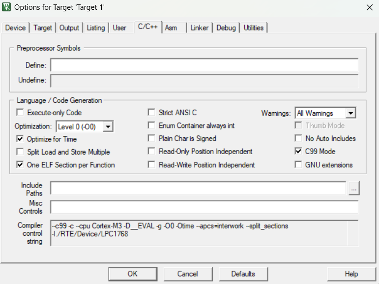

# Embedded Media Center Using MCB1700 Board
If you are taking this course please do **NOT** copy my work, rather use it as a reference

## Table of Content
- [Objective](#objective)
- [Introduction](#introduction)
  - [Libraries](#libraries)
  - [Controls](#controls)
  - [Setup](#setup)
- [Architecture](#architecture)
  - [Finite State Machine Diagram](#finite-state-machine-diagram)
  - [Finite State Machine Code](#finite-state-machine-code)
- [Home Screen and Game Screen](#home-screen-and-game-screen)
  - [Home Screen Code](#home-screen-code)
  - [Game Center Screen Code](#game-center-screen-code)
  - [Helper Functions](#helper-functions)
- [Photo Gallery and Joke Machine](#photo-gallery-and-joke-machine)
  - [Photo Gallery C Code](#photo-gallery-c-code)
  - [Photo Gallery Header File](#photo-gallery-header-file)
  - [Photo Gallery Display Code](#photo-gallery-display-code)
  - [Jokes C Code](#jokes-c-code)
  - [Jokes Header File](#jokes-header-file)
  - [Jokes Display Code](#jokes-display-code)
  - [Helper Functions](#helper-functions-1)
- [MP3 Player](#mp3-player)
  - [MP3 Code](#mp3-code)
- [Games](#games)
- [Game 1 (Snake)](#game-1-snake)
  - [Snake Code](#snake-code)
  - [Snake Header File](#snake-header-file)
  - [Snake Main Function](#snake-main-function)
- [Game 2 (Infinite Runner)](#game-2-infinite-runner)
  - [Infinite runner Code](#infinite-runner-code)
  - [Infinite Runner Header File](#infinite-runner-header-file)
  - [Infinite Runner Assets/Images](#infinite-runner-assetsimages)
  - [Infinite Runner Assets/Images header file](#infinite-runner-assetsimages-header-file)
  - [Infinite Runner Main Function](#infinite-runner-main-function)
- [Issues Encountered](#issues-encountered)
- [Ideas Scrapped](#ideas-scrapped)
- [Appendix](#appendix)
  - [main.c](#mainc)
  - [mp3.c](#mp3c)
  - [snake.c](#snakec)
  - [did\_he\_run.c](#did_he_runc)
  - [jokes.c](#jokesc)


## Objective

The objective of this final project is to design and develop a fully functional media center using the MCB1700 development board, the Keil uVision IDE, and the concepts and skills we've learnt throughout this semester. The media center will include a Photo Gallery, capable of displaying various BMP image files. Additionally, it will feature an MP3 Player that streams audio tracks directly from a PC. Another component will be the Joke Center, which will display humorous content, giving the project a fun and interactive element while allowing us to explore string manipulation and user interface design. Lastly, the media center will include a Game Center with at least two animated games for users to play, demonstrating our ability to create dynamic and interactive applications.

## Introduction

The goal of this project is to design and implement a media center using the NXP LPC1768 microcontroller on the MCB1700 board, utilizing Keil uVision as the development environment. The system setup follows similar steps from previous labs, starting with the creation of a uVision project and configuring the runtime environment specifically for the LPC1768 chip. The runtime environment was then configured as follows:

### Libraries


Figure 1.0 (Runtime Environment)

In addition to the runtime environments, 2 more libraries were added:

1.  GLCD library for interfacing with the LCD Screen
2.  KBD library for interfacing with the joystick

These Libraries were provided during the first lab.


Figure 2.0 (Media Center Controls)

### Controls

Joystick:

1.  Up and Down: moves selection up and down respectively
2.  Right and Left: shows next and previous image in the photo gallery respectively
3.  Press: Select the current highlighted option and go

Back Button:

Returns from the current state to the previous state (Goes to previous page).

### Setup



Figure 3.0 (Target Configuration)

C99 is used for the project, and Optimization Level 0 should be selected since using other optimization functions would omit instructions and make the MP3 player stream very distorted music

## Architecture

The Code follows a Finite State Machine Architecture. There are 7 states, each representing a requirement of the project. The Jokes feature is an extra state that was implemented as an additional feature.

### Finite State Machine Diagram


Figure 4.0 (FSM Diagram)

### Finite State Machine Code

```C
#include <stdint.h>
#include <stdio.h>
#include <stdlib.h>

#include "Board_Buttons.h"
#include "GLCD.h"
#include "KBD.h"
#include "LED.h"
#include "LPC17xx.h"
#include "audio_stream_files/usbdmain.h"
#include "did_he_run_main.h"
#include "jokes.h"
#include "photo_gallery_images.h"
#include "snake.h"

// Font index 16x24
#define __FI 1

// Joystick Values

#define UP 8
#define DOWN 32
#define LEFT 64
#define RIGHT 16
#define NEUTRAL 0
#define PRESSED 1

// ARRAY SIZES
#define PHOTO_GALLERY_ARRAY_SIZE 4
#define MENU_ARRAY_SIZE 4
#define GAME_ARRAY_SIZE 2
#define JOKE_ARRAY_SIZE 44

// STATES
#define PHOTO_GALLERY 0
#define MP3_PLAYER 1
#define JOKE_MACHINE 2
#define GAME_CENTER 3

#define HOME_SCREEN 4

#define SNAKE 5
#define DID_HE_RUN 6

// Global Variables used for flow control between states
int selector = 0;
int prev_direction, direction;

/*
 * main: initialize and start the system
 */

int main(void) {
    int page_to_show = HOME_SCREEN;
    int new_page = HOME_SCREEN;
    int previous_page = HOME_SCREEN;

    char *home_screen_options[] = {"Photo Gallery", "MP3 Player",
                                   "Joke Machine", "Game Center"};
    char *game_center_options[] = {"Snake", "Did He Run?"};
    LED_Init();
    GLCD_Init();
    LCD_Template();
    KBD_Init();
    Buttons_Initialize();

    for (;;) {
        previous_page = page_to_show;  // Update previous_page before
                                       // page_to_show is updated
        page_to_show = new_page;
        switch (page_to_show) {
            case HOME_SCREEN:
                new_page = home_screen_main(previous_page, home_screen_options);
                break;
            case PHOTO_GALLERY:
                new_page = photo_gallery(previous_page);
                break;
            case MP3_PLAYER:
                // always returns to home screen
                new_page = mp3_music_player();
                break;
            case JOKE_MACHINE:
                new_page = joke_machine(previous_page);
                break;
            case GAME_CENTER:
                new_page = game_center(previous_page, game_center_options);
                break;
            case SNAKE:
                new_page = snake_main(previous_page);
                break;
            case DID_HE_RUN:
                new_page = did_he_run_main(previous_page);
                break;
        }
    }
}

```

Code 1.0 (Main.c)

## Home Screen and Game Screen


Figure 5.0 (Home Screen)


Figure 6.0 (Game Center Screen)

The Selected Item is Highlighted in Green. The joystick has to be released to move on to select the next item, this is just to eliminate the use of delay functions, therefore improving the performance of the code. The selector cycles through the listed items, when the user moves the joystick up, while the selector is at the top of the list, the selector will be updated to highlight the item on the bottom of the list. This is done to have a better user experience and easier navigation of the media center. Both the home screen and the game center screen have almost identical design and their code is almost identical. The reason their code is separated is for readability. Otherwise, the same function could have been used for both states with minor modifications.

### Home Screen Code

```C
int home_screen_main(int previous_page, char *home_screen_options[]) {
    if (previous_page != HOME_SCREEN) {
        LCD_Template();
        selector = 0;
    }
    direction = get_button();
    if (prev_direction == NEUTRAL) {
        selector = menu_selector(selector, direction, MENU_ARRAY_SIZE);
        screen_options_select(selector, home_screen_options, MENU_ARRAY_SIZE);
    }
    prev_direction = direction;

    // button
    if (get_button() == PRESSED) {
        // Selector's value is equal to the page's number
        return selector;
    }
    return HOME_SCREEN;
}

```

Code 2.0 (Home Screen Code)

### Game Center Screen Code

```C
int game_center(int previous_page, char *game_center_options[]) {
    if (previous_page != GAME_CENTER) {
        LCD_Template();
        selector = 0;
    }
    direction = get_button();
    if (prev_direction == NEUTRAL) {
        selector = menu_selector(selector, direction, GAME_ARRAY_SIZE);
        screen_options_select(selector, game_center_options, GAME_ARRAY_SIZE);
    }
    prev_direction = direction;

    if (Buttons_GetState()) return HOME_SCREEN;

    if (get_button() == PRESSED) {
        // Selector's value is equal to the page's number
        return selector + 5;
    }

    return GAME_CENTER;
}
```
Code 3.0 (Game Center Screen Code)

### Helper Functions

```C
void LCD_Template() {
    // Clear graphical LCD display
    GLCD_Clear(White);

    // Set a blue background with yellow text fot the LCD display
    // Add the Headers from the lab manual

    GLCD_SetBackColor(Blue);
    GLCD_SetTextColor(Yellow);
    GLCD_DisplayString(0, 0, __FI, (unsigned char *)"     COE718 Demo    ");
    GLCD_SetTextColor(White);
    GLCD_DisplayString(1, 0, __FI, (unsigned char *)"      Project         ");
    GLCD_DisplayString(2, 0, __FI, (unsigned char *)"   Ahmad EL-Gohary  ");
    GLCD_SetBackColor(White);
    GLCD_SetTextColor(Blue);
}

int menu_selector(int selector, int joystick_value, int array_size) {
    if (joystick_value == UP) {
        if (selector == 0) {
            selector = array_size - 1;
        } else {
            selector--;
        }

    } else if (joystick_value == DOWN) {
        if (selector == array_size - 1) {
            selector = 0;
        } else {
            selector++;
        }
    }
    return selector;
}

void screen_options_select(int selector, char *screen_options[],
                           int size_of_array) {
    int i;
    for (i = 0; i < size_of_array; i++) {
        if (i == selector) {
            GLCD_SetBackColor(Green);
        } else {
            GLCD_SetBackColor(White);
        }
        GLCD_DisplayString(6 + i, 0, __FI, (unsigned char *)screen_options[i]);
    }
}
```

Code 4.0 (Home Screen and Game Center Screens Helper Functions)

## Photo Gallery and Joke Machine


Figure 7.0 (Photo Gallery)


Figure 8.0 (Joke Machine)

The Selected Item is displayed on the screen. The joystick has to be released to move on to select the next item, this is just to eliminate the use of delay functions, therefore improving the performance of the code. The selector cycles through the listed items, when the selector is displaying an item at the end of the list, and the user moves the joystick to the left, (to display the next item) the selector is reset to 0 to display the item at the beginning of the list, and vise versa. This is done to have a better user experience and easier navigation of the photo gallery and the jokes. Both the Images and the jokes follow similar patterns were there is a single array for the images and another array for the jokes, this array is used to display the next item in the array when the selector is incremented by moving the joystick to the left or decremented by moving the joystick to the right.

### Photo Gallery C Code

```C
const unsigned char melt_my_eyes_see_your_future[] = ("..."); 
const unsigned char sour[] = ("..."); 
const unsigned char guts[] = ("..."); 
const unsigned char house_of_balloons[] = ("...");
extern const unsigned char *images_for_photo_gallery[] = {melt_my_eyes_see_your_future, sour, guts, house_of_balloons};
```

Code 5.0 (Image Arrays declarations )

### Photo Gallery Header File

```C
#ifndef PHOTO_GALLERY_IMAGES_H
#define PHOTO_GALLERY_IMAGES_H
extern const unsigned char *images_for_photo_gallery[];
#endif

```
Code 6.0 (Photo Gallery Header file)

### Photo Gallery Display Code

```C
int photo_gallery(int previous_page) {
    if (previous_page != PHOTO_GALLERY) {
        LCD_Template();
    }
    direction = get_button();
    if (prev_direction == NEUTRAL) {
        selector =
            side_ways_selector(selector, direction, PHOTO_GALLERY_ARRAY_SIZE);
        GLCD_Bitmap(75, 75, 150, 150,
                    (unsigned char *)images_for_photo_gallery[selector]);
    }
    prev_direction = direction;

    if (Buttons_GetState()) return HOME_SCREEN;
    return PHOTO_GALLERY;
}
```
Code 7.0 (Photo Gallery Code)

### Jokes C Code

```C
char *jokes[] = {
    "I considered building the patio by myself. But I didn't have the stones.",
    "I've got a joke about vegetables for you... but it's a bit corny.",
    "How do you fix a broken pizza? With tomato paste.",
    ...
};

```

Code 8.0 (Jokes array decleration)

```C
// Function to split sentences into lines that fit the GLCD
void splitSentencesForGLCD(char *sentence) {
    char buffer[MAX_WIDTH + 1]; // Temporary buffer to hold a single line
		int starting_line = 3;

		int len = strlen(sentence);
		int start = 0;

		while (start < len) {
				int end = start + MAX_WIDTH;

				// Ensure we don't exceed sentence length
				if (end > len) {
						end = len;
				}

				// Find the last space within the range
				while (end > start && sentence[end] != ' ') {
						end--;
				}

				// If no space was found, break the word forcibly
				if (end == start) {
						end = start + MAX_WIDTH;
				}

				// Copy the segment into the buffer and null-terminate it
				strncpy(buffer, sentence + start, end - start);
				buffer[end - start] = '\0';

				// Print the line (replace this with the GLCD display function)
				
				GLCD_DisplayString(starting_line++, 0, __FI, (unsigned char *)buffer);


				// Move the start position forward, skipping the space
				start = end + 1;
		}
}

```

Code 9.0 (Jokes Split function)

### Jokes Header File

```C
#ifndef JOKES_H
#define JOKES_H

#include "GLCD.h" // Include GLCD header for display functions
#include <string.h>

// Font index for GLCD
#define __FI 1

// Maximum characters per line on GLCD
#define MAX_WIDTH 22

// Array of jokes to be displayed
extern char *jokes[];

// Function to split sentences into lines and display them on GLCD
void splitSentencesForGLCD(char *sentence);

#endif // JOKE_DISPLAY_H
```

Code 10.0 (Jokes Header File)

### Jokes Display Code

```C
int joke_machine(int previous_page) {
    if (previous_page != JOKE_MACHINE) {
        LCD_Template();
        selector = 0;
    }
    direction = get_button();
    if (prev_direction == NEUTRAL) {
        if (direction == LEFT || direction == RIGHT) {
            LCD_Template();
        }
        selector = side_ways_selector(selector, direction, JOKE_ARRAY_SIZE);
        splitSentencesForGLCD(jokes[selector]);
    }

    prev_direction = direction;

    if (Buttons_GetState()) return HOME_SCREEN;
    return JOKE_MACHINE;
}
```

Code 11.0 (Jokes Code)

### Helper Functions

```C
int side_ways_selector(int selector, int joystick_value, int array_size) {
    if (joystick_value == LEFT) {
        if (selector == 0) {
            selector = array_size - 1;
        } else {
            selector--;
        }

    } else if (joystick_value == RIGHT) {
        if (selector == array_size - 1) {
            selector = 0;
        } else {
            selector++;
        }
    }
    return selector;
}
```

Code 12.0 (Photo Gallery and Jokes helper function)

**  
**

## MP3 Player


Figure 9.0 (MP3 Player)

Implementing the MP3 Player was relatively simple, since it was heavily based on the sample code provided by the prof. The Code uses system interrupts to stream music from a computer to the board. Integrating the MP3 code with the existing media center code was a little challenging as the system interrupts would take over and not allow the any code to execute, making it impossible to exit the music player and return to the main menu. This was fixed by modifying the sample code of the music player, by removing an infinite loop from the music player main function and by adding an if statement to the system interrupt function such that is reads the button’s state and if the button is pressed, it disables the interrupt function and returns back to the main menu.

### MP3 Code

```C
/*****************************************************************************
**   Main Function  main()
******************************************************************************/
void stream_music (){
  volatile uint32_t pclkdiv, pclk;
  /* SystemClockUpdate() updates the SystemFrequency variable */
  SystemClockUpdate();

  LPC_PINCON->PINSEL1 &=~((0x03<<18)|(0x03<<20));  
  /* P0.25, A0.0, function 01, P0.26 AOUT, function 10 */
  LPC_PINCON->PINSEL1 |= ((0x01<<18)|(0x02<<20));

  /* Enable CLOCK into ADC controller */
  LPC_SC->PCONP |= (1 << 12);

  LPC_ADC->CR = 0x00200E04;		/* ADC: 10-bit AIN2 @ 4MHz */
  LPC_DAC->CR = 0x00008000;		/* DAC Output set to Middle Point */

  /* By default, the PCLKSELx value is zero, thus, the PCLK for
  all the peripherals is 1/4 of the SystemFrequency. */
  /* Bit 2~3 is for TIMER0 */
  pclkdiv = (LPC_SC->PCLKSEL0 >> 2) & 0x03;
  switch ( pclkdiv )
  {
	case 0x00:
	default:
	  pclk = SystemFrequency/4;
	break;
	case 0x01:
	  pclk = SystemFrequency;
	break; 
	case 0x02:
	  pclk = SystemFrequency/2;
	break; 
	case 0x03:
	  pclk = SystemFrequency/8;
	break;
  }

  LPC_TIM0->MR0 = pclk/DATA_FREQ - 1;	/* TC0 Match Value 0 */
  LPC_TIM0->MCR = 3;					/* TCO Interrupt and Reset on MR0 */
  LPC_TIM0->TCR = 1;					/* TC0 Enable */
  NVIC_EnableIRQ(TIMER0_IRQn);

  USB_Init();				/* USB Initialization */
  USB_Connect(TRUE);		/* USB Connect */
}
```
Code 13.0 (MP3 Main Function Modified)

The infinite while(1); loop has been removed as it was redundant and did not contribute to the functionality of the code

```C
void TIMER0_IRQHandler(void) 
{
  long  val;
  uint32_t cnt;

		if (DataRun) {                            /* Data Stream is running */
			val = DataBuf[DataOut];                 /* Get Audio Sample */
			cnt = (DataIn - DataOut) & (B_S - 1);   /* Buffer Data Count */
			if (cnt == (B_S - P_C*P_S)) {           /* Too much Data in Buffer */
				DataOut++;                            /* Skip one Sample */
			}
			if (cnt > (P_C*P_S)) {                  /* Still enough Data in Buffer */
				DataOut++;                            /* Update Data Out Index */
			}
			DataOut &= B_S - 1;                     /* Adjust Buffer Out Index */
			if (val < 0) VUM -= val;                /* Accumulate Neg Value */
			else         VUM += val;                /* Accumulate Pos Value */
			val  *= Volume;                         /* Apply Volume Level */
			val >>= 16;                             /* Adjust Value */
			val  += 0x8000;                         /* Add Bias */
			val  &= 0xFFFF;                         /* Mask Value */
		} else {
			val = 0x8000;                           /* DAC Middle Point */
		}

		if (Mute) {
			val = 0x8000;                           /* DAC Middle Point */
		}

		LPC_DAC->CR = val & 0xFFC0;             /* Set Speaker Output */

		if ((Tick++ & 0x03FF) == 0) {             /* On every 1024th Tick */
			get_potval();                           /* Get Potenciometer Value */
			if (VolCur == 0x8000) {                 /* Check for Minimum Level */
				Volume = 0;                           /* No Sound */
			} else {
				Volume = VolCur * PotVal;             /* Chained Volume Level */
			}
			val = VUM >> 20;                        /* Scale Accumulated Value */
			VUM = 0;                                /* Clear VUM */
			if (val > 7) val = 7;                   /* Limit Value */
		}

		LPC_TIM0->IR = 1;                         /* Clear Interrupt Flag */
		if(Buttons_GetState()){
				NVIC_DisableIRQ(TIMER0_IRQn);
				NVIC_DisableIRQ(USB_IRQn);
				return;
		}
}

```
Code 14.0 (MP3 System Interrupt Function Modified)

In the system interrupt code, an if conditional statement has been added, to the end of the function, to check if the button has been pressed, and disable the system interrupt then exit the function.

## Games

Before each game, instructions on how to play is displayed on screen


Figure 10.0 (Pre-Game Screen)

```C
void pre_game_screen() {
    GLCD_Clear(White);
    GLCD_SetBackColor(White);
    GLCD_SetTextColor(Black);
    GLCD_DisplayString(4, 0, __FI, (unsigned char *)"- Use Joystick to move");
    GLCD_DisplayString(5, 0, __FI, (unsigned char *)"- Score is displayed");
    GLCD_DisplayString(6, 0, __FI, (unsigned char *)"  after loss");
    GLCD_DisplayString(7, 0, __FI, (unsigned char *)"- Move Joystick");
    GLCD_DisplayString(8, 0, __FI, (unsigned char *)"  to start");
    GLCD_SetTextColor(Blue);
}
```
Code 15.0 (Pre-Game Screen Code)

After each game, the score is displayed along side whether the user want to restart or return back to the game center screen


Figure 11.0 (Post-Game Screen)

```C
int post_game_screen(int score, int game) {
    char score_str[5];
    snprintf(score_str, 5, "%d", score);
    GLCD_Clear(White);
    GLCD_SetBackColor(White);
    GLCD_SetTextColor(Black);
    GLCD_DisplayString(4, 0, __FI, (unsigned char *)"Score:");
    GLCD_DisplayString(4, 7, __FI, (unsigned char *)score_str);
    GLCD_DisplayString(5, 0, __FI, (unsigned char *)"Move Joystick:");
    GLCD_DisplayString(6, 0, __FI, (unsigned char *)"  - UP to Restart");
    GLCD_DisplayString(7, 0, __FI, (unsigned char *)"  - Down to Exit");
    GLCD_SetTextColor(Blue);
    while (1) {
        if (get_button() == UP) {
            return game;
        } else if (get_button() == DOWN) {
            return GAME_CENTER;
        }
    }
}
```

Code 16.0 (Post-Game Screen Code)

## Game 1 (Snake)


Figure 12.0 (Snake Game)

The first game implemented was snake, as it was simple to implement yet it is impressive and noteworthy. There was a few edge cases to handle such as the snake eating itself, the snake hitting the border of the screen, and the food being outside the playable area, however they were all fixed using proper testing.

### Snake Code

```C
#include <stdint.h>
#include <stdio.h>
#include <stdlib.h>

#include "Board_Buttons.h"
#include "GLCD.h"
#include "KBD.h"

#define UP 8
#define DOWN 32
#define LEFT 64
#define RIGHT 16
#define NEUTRAL 0
#define PRESSED 1

#define SCREEN_LENGTH 9
#define SCREEN_WIDTH 19

// Font index 16x24
#define __FI 1

int snake[144][2];
int food_x, food_y;

int snake_x, snake_y;
int snake_length = 3;

void delay() {
    int i;
    for (i = 0; i < 2500000; i++) {
        __nop();
        __nop();
    }
}

void setup_window() {
    int i;
    GLCD_DisplayString(0, 0, __FI,
                       (unsigned char *)"------------------------------");
    GLCD_DisplayString(9, 0, __FI,
                       (unsigned char *)"------------------------------");
    for (i = 0; i <= SCREEN_LENGTH; i++) {
        GLCD_DisplayString(i, 0, __FI, (unsigned char *)"|");
        GLCD_DisplayString(i, 19, __FI, (unsigned char *)"|");
    }
}

void init_game() {
    snake_x = 7;
    snake_y = 5;
    // Snake head at index 0
    snake[0][0] = snake_x;
    snake[0][1] = snake_y;

    snake[1][0] = snake_x;
    snake[1][1] = snake_y - 1;

    snake[2][0] = snake_x;
    snake[2][1] = snake_y - 2;
}

int generate_food_helper(int food_x, int food_y) {
    // returns true if the food generated is not in the snake
    int i;
    for (i = 0; i < snake_length; i++) {
        if (food_x == snake[i][0] && food_y == snake[i][1]) {
            return 0;
        }
    }
    return 1;
}

void generate_food() {
    do {
        food_y = rand() % (SCREEN_LENGTH - 1) + 1;
        food_x = rand() % (SCREEN_WIDTH - 1) + 1;

    } while (!generate_food_helper(food_x, food_y));
}

int detect_collisions() {
    // checks if the snake ate itself
    int i;
    for (i = 1; i < snake_length; i++)
        if (snake[0][0] == snake[i][0] && snake[0][1] == snake[i][1]) return 1;
    if (snake[0][0] == 0 || snake[0][0] == SCREEN_LENGTH || snake[0][1] == 0 ||
        snake[0][1] == SCREEN_WIDTH)
        return 1;

    return 0;
}

void update_snake() {
    int i;
    for (i = snake_length - 1; i > 0; i--) {
        GLCD_DisplayChar(snake[i][0], snake[i][1], 1, ' ');
        snake[i][1] = snake[i - 1][1];
        snake[i][0] = snake[i - 1][0];
    }
    snake[0][0] = snake_x;
    snake[0][1] = snake_y;
    for (i = 0; i < snake_length; i++) {
        GLCD_DisplayChar(snake[i][0], snake[i][1], 1, 0x83);
    }
}

int snake_game() {
    int direction;
    int score = 0;
    snake_length = 3;
    init_game();
    setup_window();
    generate_food();
    GLCD_DisplayString(food_y, food_x, __FI, (unsigned char *)"*");
    while (1) {
        if (get_button()) {
            direction = get_button();
        }

        switch (direction) {
            case UP:
                snake_x = snake_x - 1;
                snake_y = snake_y;
                break;
            case DOWN:
                snake_x = snake_x + 1;
                snake_y = snake_y;
                break;
            case LEFT:
                snake_x = snake_x;
                snake_y = snake_y - 1;
                break;
            case RIGHT:
                snake_x = snake_x;
                snake_y = snake_y + 1;
                break;
            default:
                snake_x = snake_x;
                snake_y = snake_y + 1;
                break;
        }
        update_snake();
        if (snake[0][0] == food_y && snake[0][1] == food_x) {
            score += 1;
            snake_length++;
            generate_food();
            GLCD_DisplayString(food_y, food_x, __FI, (unsigned char *)"*");
        }
        if (detect_collisions()) return score;
        delay();
    }
}
```

Code 17.0 (Snake Game Code)

### Snake Header File

```C
#ifndef SNAKE_GAME_H
#define SNAKE_GAME_H
#define SCREEN_LENGTH   8
#define SCREEN_WIDTH    18

// Font index for GLCD (16x24)
#define __FI            1

// Snake game variables
extern int snake[144][2];     // Snake coordinates (maximum length 144)
extern int food[2];           // Food coordinates (x, y)
extern int snake_x, snake_y;  // Snake head position
extern int snake_length;      // Length of the snake

// Function prototypes
void setup_window(void);                 // Sets up the initial game window
void init_game(void);                    // Initializes the snake game state
void generate_food(void);                // Generates food at random position
int generate_food_helper(int food_x, int food_y); // Helper function to check if food overlaps snake
int detect_collisions(void);             // Detects if snake collides with itself or walls
void update_snake(void);                 // Updates snake position and displays on the screen
int snake_game(void);                   // Main game loop, handles user input and game logic

#endif // SNAKE_GAME_H
```

Code 18.0 (Snake Game Header File)

### Snake Main Function

```C
int snake_main(int previous_page) {
    int game_score;

    if (previous_page != SNAKE) {
        pre_game_screen();
    }
    while (!get_button());
    GLCD_Clear(White);
    GLCD_SetBackColor(White);
    game_score = snake_game();
    return post_game_screen(game_score, SNAKE);
}
```

Code 19.0 (Snake Game Main Function)

## Game 2 (Infinite Runner)

An infinite runner game which references a pop culture event, and an internet joke was implemented, as it was a fun idea and a challenging game to implement.


Figure 13.0 (Infinite Runner Game)

### Infinite runner Code

```C
#include <stdio.h>
#include <stdint.h>
#include <stdlib.h>

#include "GLCD.h"
#include "KBD.h"
#include "did_he_run_images.h"

#define UP 				8 
#define DOWN			32
#define LEFT			64
#define RIGHT			16
#define NEUTRAL   0
#define PRESSED		1

int score = 0;

void delay__(){
	int i;
	for(i = 0; i<50; i++){
		__nop();
	}
	
}
int move_player(int lane, int direction){

		
		if(direction == UP){
			if(lane == 1 || lane == 2){
				lane--;
			}

		}else if(direction == DOWN){
			if(lane == 0 || lane == 1){
				lane++;
			} 
		}
		return lane;
}
int detect_collisions_(int diddy_lane, int bottle_lane, int bottle_x, int not_police_lane, int police_x){
	// 49 is diddy far right edge
	// 29 is the bottle's image width
	if(diddy_lane == bottle_lane && (bottle_x <= 49 || (bottle_x + 29) <= 1 )){ 
		// this a collision with the bottle, so increase score by 1 and return 0
		score++;
		return 0;
	}
	else if(diddy_lane != not_police_lane && (police_x <= 49 || (police_x + 29) <= 1 )){
		// this a collision with the police, so return 1 to exit the game
		return 1;
	}
	// returning 2 means no collison
	return 2;
}
int did_he_run_game(){
		int player_position = 0;
		int police_empty_position;
		int baby_oil_position;
		int direction;
		int	prev_direction = 0;
		int i, j;
		int bottle_horizontal_position;
		int bottle_starting_horizontal_position = 150;
		int police_horizontal_position = 270;
		int collision_value = 2;
		i = 0;
		j = 0;
		score = 0;	
		police_empty_position = rand() % 3;
		baby_oil_position = rand() % 3;

		GLCD_Bitmap(0,0,320,241, (unsigned char *)diddy_run_images[0]);				// road		
		GLCD_Bitmap(1,11,48,68, (unsigned char *)diddy_run_images[1]); 				// diddy lane 1
		while(1){			
			direction = get_button();
			if(prev_direction == NEUTRAL){
				player_position = move_player(player_position, direction);			
			}
			if(prev_direction != direction){
				switch(player_position){
					case 0:
						GLCD_Bitmap(1,11,48,68, (unsigned char *)diddy_run_images[1]); 				// diddy lane 1
						GLCD_Bitmap(1,85,48,68, (unsigned char *)diddy_run_images[4]); 				// clear diddy lane 2
						GLCD_Bitmap(1,159,48,68, (unsigned char *)diddy_run_images[4]); 				// clear diddy lane 3
						break;
					case 1:
						GLCD_Bitmap(1,85,48,68, (unsigned char *)diddy_run_images[1]); 				// diddy lane 2
						GLCD_Bitmap(1,11,48,68, (unsigned char *)diddy_run_images[4]); 				// clear diddy lane 1
						GLCD_Bitmap(1,159,48,68, (unsigned char *)diddy_run_images[4]); 				// clear diddy lane 3

						break;
					case 2:
						GLCD_Bitmap(1,159,48,68, (unsigned char *)diddy_run_images[1]); 			// diddy lane 3
						GLCD_Bitmap(1,11,48,68, (unsigned char *)diddy_run_images[4]); 				// clear diddy lane 1
						GLCD_Bitmap(1,85,48,68, (unsigned char *)diddy_run_images[4]); 				// clear diddy lane 2
						break;
				}
			}
				
			bottle_horizontal_position = bottle_starting_horizontal_position  - i;
			police_horizontal_position =270 - j;	

			if(police_empty_position == 0){
				GLCD_Bitmap(police_horizontal_position,85,39,68, (unsigned char *)diddy_run_images[2]); 			// police lane 2
				GLCD_Bitmap(police_horizontal_position,159,39,68, (unsigned char *)diddy_run_images[2]); 		// police lane 3
			}else if(police_empty_position == 1){
				GLCD_Bitmap(police_horizontal_position,11,39,68, (unsigned char *)diddy_run_images[2]); 			// police lane 1
				GLCD_Bitmap(police_horizontal_position,159,39,68, (unsigned char *)diddy_run_images[2]); 		// police lane 3
			}else if(police_empty_position == 2){
				GLCD_Bitmap(police_horizontal_position,11,39,68, (unsigned char *)diddy_run_images[2]); 			// police lane 1
				GLCD_Bitmap(police_horizontal_position,85,39,68, (unsigned char *)diddy_run_images[2]); 			// police lane 2
			}
			
			if(baby_oil_position == 0){
				GLCD_Bitmap(bottle_horizontal_position,11,29,68, (unsigned char *)diddy_run_images[3]);			// baby oil lane 1
			}else if(baby_oil_position == 1){
				GLCD_Bitmap(bottle_horizontal_position,85,29,68, (unsigned char *)diddy_run_images[3]);			// baby oil lane 2				
			}else if(baby_oil_position == 2){
				GLCD_Bitmap(bottle_horizontal_position,159,29,68, (unsigned char *)diddy_run_images[3]);			// baby oil lane 3
			}
			
			if (bottle_horizontal_position == -29){
				bottle_starting_horizontal_position =250;
				i = 0;
			}
			if (police_horizontal_position == -39){
				police_horizontal_position = 270;		
				j = 0;
				police_empty_position = rand() % 3;
			}
			collision_value = detect_collisions_(player_position, baby_oil_position, bottle_horizontal_position, police_empty_position, police_horizontal_position);
			
			if(collision_value == 0){
				// delete the bottle 
				if(baby_oil_position == 0){
							GLCD_Bitmap(bottle_horizontal_position,11,48,68, (unsigned char *)diddy_run_images[4]); 				// clear bottle lane 1
				}else if(baby_oil_position == 1){
							GLCD_Bitmap(bottle_horizontal_position,85,48,68, (unsigned char *)diddy_run_images[4]); 				// clear bottle lane 2		
				}else if(baby_oil_position == 2){
							GLCD_Bitmap(bottle_horizontal_position,159,48,68, (unsigned char *)diddy_run_images[4]); 				// clear bottle lane 3
				}
				bottle_starting_horizontal_position = police_horizontal_position + 60;
				i=0;
				baby_oil_position = rand() % 3;
			}else if(collision_value == 1){
				return score;
			}

			i++;
			j++;
			prev_direction = direction;
			delay__();
	}
}
```
Code 20.0 (Infinite Runner Game Code)

### Infinite Runner Header File

```C
#ifndef DID_HE_RUN_MAIN_H
#define DID_HE_RUN_MAIN_H

// Function prototypes
int move_player(int lane);                 // Moves the player up and down the screen/lanes
int did_he_run_game(void);                    // Main game loop, handles user input and game logic

#endif 
```

Code 21.0 (Infinite Runner Header File)

### Infinite Runner Assets/Images

```C
const unsigned char three_lanes[] = ("..."); 
const unsigned char diddy[] = ("..."); 
const unsigned char police[] = ("..."); 
const unsigned char baby_oil[] = ("..."); 
const unsigned char black_screen[] = ("...");
const unsigned char *diddy_run_images[]= {three_lanes, diddy, police, baby_oil, black_screen};
```

Code 22.0 (Infinite Runner Images and Arrays declaration Code)

### Infinite Runner Assets/Images header file

```C
#ifndef DID_HE_RUN_H
#define DID_HE_RUN_H
extern const unsigned char *diddy_run_images[];
#endif

```

Code 23.0 (Infinite Runner Images and Arrays declaration Header File)

### Infinite Runner Main Function

```C
int did_he_run_main(int previous_page) {
    int game_score;
    if (previous_page != DID_HE_RUN) {
        pre_game_screen();
    }
    while (!get_button());
    game_score = did_he_run_game();
    return post_game_screen(game_score, DID_HE_RUN);
}

```

Code 24.0 (Infinite Runner Game Main Code)

## Issues Encountered

1.  Memory Issues

    Initially there were 7 images in the Photo Gallery, this was taking up so much space on the board, which made it not possible to add the second game to the media center code, since the code was taking more memory than the board has. This was fixed by removing 3 images from the code, which then allowed the second game to be integrated to the code.

2.  MP3 Exit Issue

    The system interrupts would take over and not allow the any code to execute, making it impossible to exit the music player and return to the main menu. This was fixed by modifying the sample code of the music player, by removing an infinite loop from the music player main function and by adding an if statement to the system interrupt function such that is reads the button’s state and if the button is pressed, it disables the interrupt function and returns back to the main menu.

3.  Bug in Snake

    When restarting the game of snake, the snake size would not resize causing an issue where the snake would be longer than 3, this was fixed by resetting the snake_length variable to 3.

4.  Collisions in the infinite runner

    Collisions in the infinite runner game only worked when the far right edge of the player has hit he far left edge of collectable item or the police. This caused the collisions to not work properly where as if the player does not collide with an item head on, the collision would not count. This was fixed by adding another condition in the if statement (bottle_x \<= 49 \|\| (bottle_x + 29) \<= 1 ) and (police_x \<= 49 \|\| (police_x + 29) \<= 1 ) to detect if the images overlap at any point, this makes it such that collisions are always detected and making the game more playable.

## Ideas Scrapped

1.  Doom

    Due to the time limitations and other commitments, DOOM had to be scrapped as final exams are getting closer and implementing DOOM would be implementing it just for the sake of implementing it and for the jokes. It was not logical to spend another week on the project to implement DOOM, when the project was fully functional and already of the highest quality.

2.  Connecting the board to the internet

    Originally the joke machine would have been connected to the internet, and it would send API requests to a server to get the jokes, however, after some testing and inspecting the board, this was not feasible, as the board required and ethernet cable to be connected to the internet, but in the lab there was no accessible ethernet cable to connect to the board. Thus this idea was scrapped and replaced with a large array of jokes of which the user can cycle through
